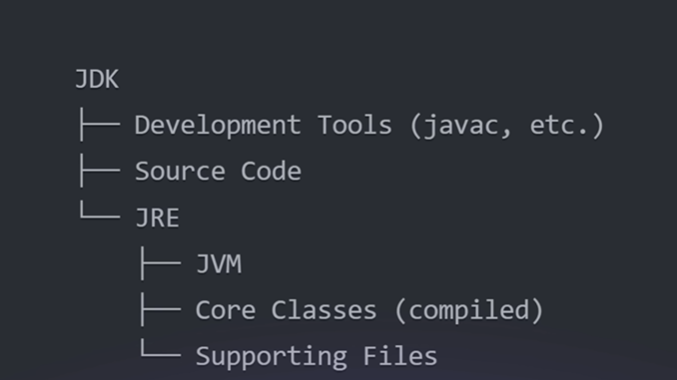
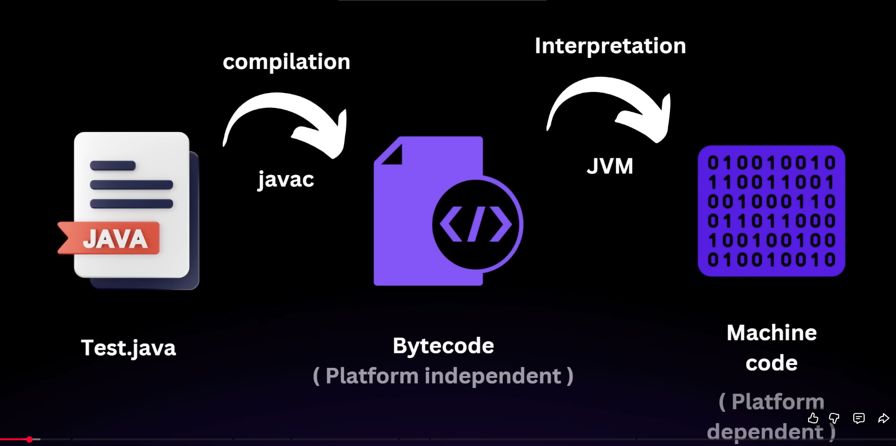
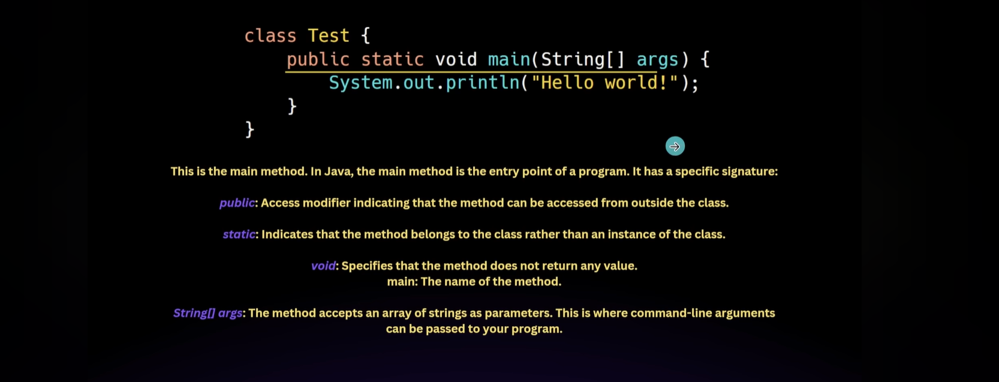
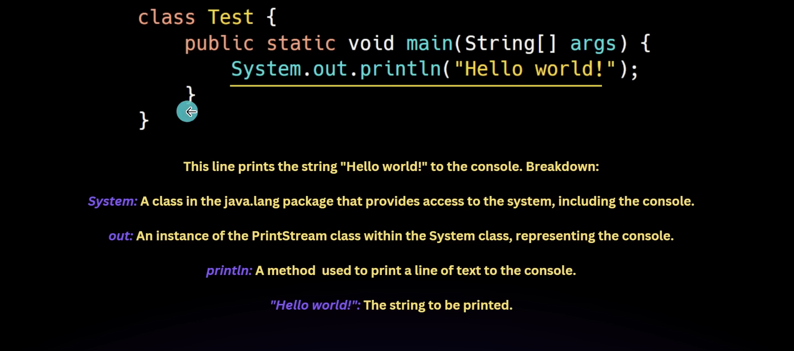
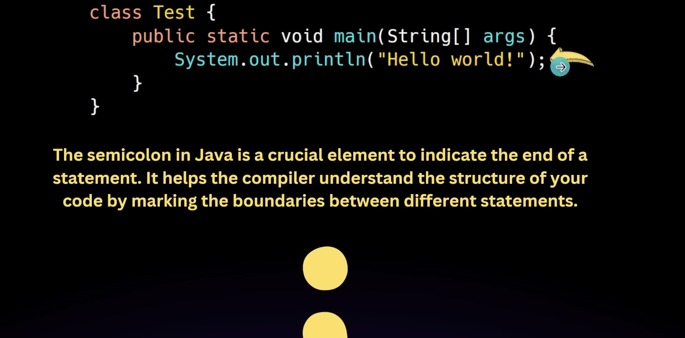

JDK contains JRE which contains JVM
Developers need JDK to create Java applications
End users only need JRE to run java applications
JVM is the actual engine that runs the java bytecode on any platform